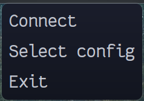
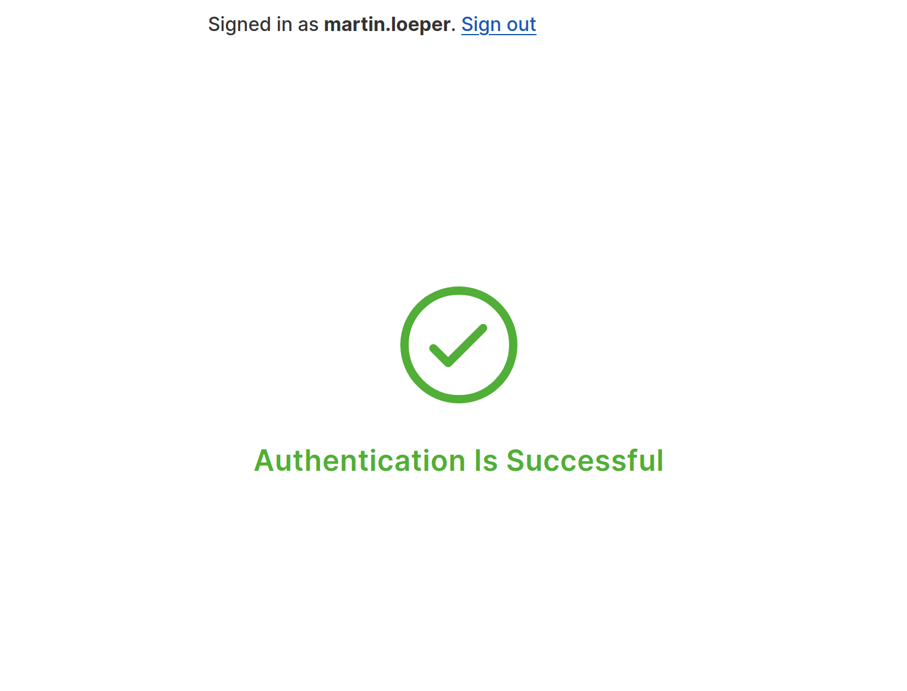

# openvpn3-applet (for Linux)

Prerequisites:
* openvpn3-linux (https://github.com/OpenVPN/openvpn3-linux)
* yad (https://github.com/v1cont/yad)

To start the applet, just launch the following script:
./src/openvpn3applet.sh

See ./src/openvpn3applet.sh -h for more information

## Autostart
If you run a Desktop Environment like KDE, add the bash script to "System Settings" -> "Startup and Shutdown" -> "Autostart" -> "Applications" (add).

## Preview

### Icon shows connection status
- red -> disconnected   
- green -> connected   
- blue -> connecting   

### Popup Menu to manage the connection when clicking on the icon

### Applet controls the openvpn3 binary which opens the browser for sso

## Author

`Caro <caroline.hemberger@nesto-software.de>`

License: MIT

## Contributors

- `Martin <martin.loeper@nesto-software.de>`
- Feel free to open an issue or PR if you have any proposal...